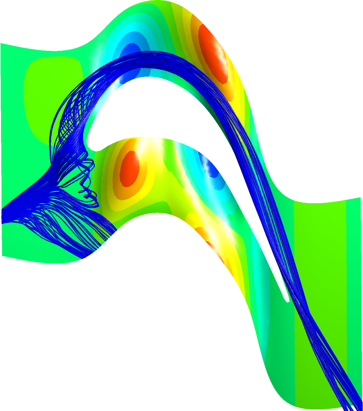

# TurbineOpti  
A collection of Matlab scripts used for the kriging surrogate model assisted optimization of low speed turbine endwalls

## Introduction
This software was originally written for the MathWorks Matlab runtime, as an automated design optimization routine for non-axisymmetric turbine endwalls. 

This is because of the computational expense associated with the simulation of the (fluid) flows involved, the optimization approach is based on the so-called DACE (Design of Computer Experiments - "Efficient Global Optimization of Expensive Black-Box Functions" of Jones, Schonlau & Welch 1998), which itself is based on the geostatistical "Kriging" method for estimating mineral deposits. 

Currently, the scripts are designed for used with the following 3rd party software:

* Base geometry generation (Gambit)
* Mesh generation (Ansys ICEMCFD Rel 12)
* CFD solver (Ansys Fluent Rel 12)

but it should not be difficult to subsitute alternative providers as required. 

The software has already been integrated with OpenFOAM but these scripts are not included at this stage. Please contact the author if you are interested in obtaining these. 

## Running the code
The code can be run with a GUI or headlessly. Both start up scripts are included. 

* `TurbineOpti.m -> GUI version`
* `TurbineOpti_nogui.m -> headless version`

## Literature
This code was used as the basis of the designs produced for:

_Bergh, J and Snedden, GC (2015) "Evaluation of the effectiveness of various metrics used in the design of non-axisymmetric turbine endwall contours", In proceedings of 22nd International Symposium on Air Breathing Engines (ISABE2015)_

_Bergh, J (2018) "On the Evaluation of Common Design Metrics for the Optimization of Non-Axisymmetric Endwall Contours for a 1-stage Turbine Rotor", PhD thesis, University of Cape Town, South Africa_

## Citation
Citing this work:
    `to be confirmed`
